# RAGLint Architecture

Visual overview of RAGLint's architecture and data flow.

## System Architecture


## Data Flow


## Component Breakdown

### 1. CLI Layer (`cli.py`)
- **Purpose**: Command-line interface
- **Features**: 
  - Argument parsing (Click)
  - Error handling with exit codes
  - Logging integration
  - Progress display

### 2. Core Analyzer (`core.py`)
- **Purpose**: Orchestrates analysis
- **Features**:
  - Sync & async processing
  - Auto mode detection
  - Progress tracking
  - Results aggregation

### 3. LLM Providers (`llm.py`)
- **Purpose**: Abstract LLM interactions
- **Providers**:
  - `OpenAI_LLM`: Async OpenAI client
  - `OllamaLLM`: Async Ollama client
  - `MockLLM`: Testing without APIs

### 4. Metrics (`metrics/`)

#### Chunking (`chunking.py`)
```python
Input: List[str] # Chunks
Output: Dict[str, float]  # {mean, std, min, max}
```

#### Retrieval (`retrieval.py`)
```python
Input: (retrieved: List[str], ground_truth: List[str])
Output: Dict[str, float]  # {precision, recall, mrr, ndcg}
```

#### Semantic (`semantic.py`)
```python
Input: (texts1: List[str], texts2: List[str])
Output: float  # Similarity score 0-1
```

#### Faithfulness (`faithfulness.py`)
```python
Input: (query: str, contexts: List[str], response: str)
Output: (score: float, reasoning: str)
```

### 5. Reporting (`reporting/`)
- **HTML Generator**: Jinja2 templates
- **Features**:
  - Interactive charts (Chart.js)
  - Responsive design
  - Exportable data

## Async Processing Architecture


**Performance**: 2-20x faster with async!

## Configuration Flow


**Priority**: CLI Args > Env Vars > Config File > Defaults

## Testing Architecture

```mermaid
graph TB
    subgraph "Test Suite"
        A[Integration Tests] --> F[53 Tests Total]
        B[Unit Tests] --> F
        C[Async Tests] --> F
        D[CLI Tests] --> F
        E[Error Tests] --> F
    end
    
    F --> G[pytest]
    G --> H[Coverage: 78%]
    G --> I[All Pass ✅]
    
    style F fill:#2196F3
    style H fill:#4CAF50
    style I fill:#4CAF50
```



## Deployment Pipeline


## File Structure

```
raglint/
├── cli.py              # CLI entry point
├── core.py             # Main analyzer (async)
├── llm.py              # LLM providers (async)
├── config.py           # Configuration
├── logging.py          # Logging setup
├── metrics/
│   ├── chunking.py     # Chunk analysis
│   ├── retrieval.py    # Retrieval metrics
│   ├── semantic.py     # Semantic matching
│   ├── faithfulness.py # Faithfulness (async)
│   └── relevance.py    # Relevance scoring
└── reporting/
    ├── html_generator.py
    └── templates/
        └── report.html
```

## Technology Stack

| Layer | Technology |
|-------|-----------|
| **CLI** | Click |
| **Async** | asyncio, aiohttp |
| **LLM** | OpenAI, Ollama |
| **Embeddings** | sentence-transformers |
| **Metrics** | scikit-learn, numpy |
| **Templates** | Jinja2 |
| **Charts** | Chart.js |
| **Testing** | pytest, pytest-asyncio |
| **Linting** | ruff, mypy, black |
| **CI/CD** | GitHub Actions |

## Performance Characteristics

| Operation | Time Complexity | Space Complexity |
|-----------|----------------|------------------|
| Basic Metrics | O(n) | O(n) |
| Retrieval Metrics | O(n·m) | O(n+m) |
| Semantic (Sync) | O(n) | O(n·d) |
| Faithfulness (Sync) | O(n·L) | O(n) |
| Faithfulness (Async) | O(L) | O(n) |

*where n = items, m = contexts, d = embedding dim, L = LLM latency*

## Security Considerations

- ✅ API keys via environment variables
- ✅ YAML config validation
- ✅ Input sanitization
- ✅ No code execution from untrusted sources
- ✅ Secure HTTP connections (HTTPS)

## Extension Points

### Adding New LLM Providers

```python
class CustomLLM(BaseLLM):
    def generate(self, prompt: str) -> str:
        # Synchronous implementation
        pass
    
    async def agenerate(self, prompt: str) -> str:
        # Async implementation
        pass
```

### Adding New Metrics

```python
def custom_metric(data: List[Dict]) -> float:
    # Your metric logic
    return score
```

Register in `metrics/__init__.py`.

## Future Architecture

Planned improvements:

- 🔄 **Caching Layer**: Redis/SQLite for LLM responses
- 📊 **Metrics Dashboard**: Real-time monitoring
- 🔌 **Plugin System**: Custom metrics & providers
- 📦 **Batch API**: Process multiple files
- 🌐 **Web UI**: Browser-based interface

---

**Last Updated**: 2024-11-21  
**Version**: 0.2.0
